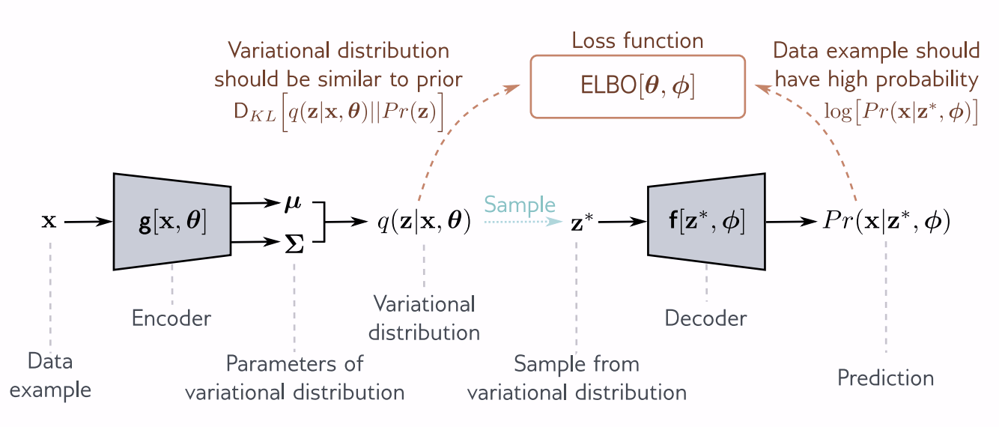

# 1. Overview
- As generative models do, VAEs aim to model the probability distribution $p(\mathbf{x})$, where $\mathbf{x}$ is the random variable representing the data.

- VAEs cannot actually evaluate the probability density $p(\mathbf{x})$ for a given sample $\mathbf{x}$ directly. However, VAEs do
allow you to sample from $p(\mathbf{x})$.

- In Maximum Likelihood Estimation, we would directly attempt to maximize the likelihood of our observed data under our model of the probability distribution.

- In VAEs, we instead maximize a lower bound for the likelihood, called the ELBO.

# 2. Latent Variable Models
Model a joint distribution $p(\mathbf{x}, \mathbf{z})$, and express $p(\mathbf{x})$ as:
$$
\int p(\mathbf{x}, \mathbf{z}) d \mathbf{z}
$$
This joint distribution is typically modeled as this product:
$$
p(\mathbf{x}, \mathbf{z}) = p(\mathbf{x} | \mathbf{z}) p(\mathbf{z})
$$
This breakdown lets you model complex distributions with relatively simple ones.

## a. Example: Mixture of Gaussians
You can write a mixture of Gaussians this way, for instance the latent variable $\mathbf{z}$ could be discrete, and tell you which Gaussian you are sampling from, and $p(\mathbf{x} | \mathbf{z})$ would be a different Gaussian based on the value of $\mathbf{z}$.

In this case, we can compute $p(\mathbf{x})$ directly by marginalizing (summing) over $\mathbf{z}$.

## b. VAEs/Continuous Latent Variable Models
We will set up the VAE as a latent variable model.
1. The prior is the standard normal distribution:
$$p(\mathbf{z}) = N_{\mathbf{z}}(\mathbf{0}, \mathbf{I})$$
2. The likelihood is is a normal distribution, whose mean is approximated by a neural network $\mathbf{f}$, which is the decoder of the VAE. The distribution has a spherical covariance of $\sigma^2 \mathbf{I}$.
$$
p_{\phi}(\mathbf{x} | \mathbf{z}) = N_{\mathbf{x}}(\mathbf{f}_{\phi}\left[\mathbf{z} \right], \sigma^2\mathbf{I})
$$
3. We also define another distribution:
$$q_{\phi}(\mathbf{z} | \mathbf{x}) = N_{\mathbf{z}} ( \mathbf{g}_{\phi}(\mathbf{x})_{\mu}, \mathbf{g}_{\phi}(\mathbf{x})_{\Sigma})$$
This is another normal distribution whose mean and variance are approximated by a neural network $\mathbf{g}$, called the encoder. 

The likelihood of $\mathbf{x}$ under the parameters $\phi$ is:
$$
p_{\phi}(\mathbf{x}) = \int p_{\phi}(\mathbf{x}, \mathbf{z}) d\mathbf{z}
$$
$$
 = \int p_{\phi}(\mathbf{x} | \mathbf{z}) p(\mathbf{z}) d\mathbf{z}
$$
$$
 = \int N_{\mathbf{x}}\left[ \mathbf{f}_{\phi}[\mathbf{z}], \sigma^2 \mathbf{I} \right] \cdot N_{\mathbf{z}} [\mathbf{0}, \mathbf{I}] d\mathbf{z}
$$

Which is a weighted sum of Gaussians of different means, where the means are the decoder outputs $\mathbf{f}_{\phi}[\mathbf{z}]$ where $\mathbf{z} \sim p(\mathbf{z})$, and the weight on each Gaussian is $p(\mathbf{z})$.

Note that the encoder does not determine the model's likelihood of the data. We will soon see that it does determine the evidence lower bound (ELBO), which is a lower bound on the likelihood, that approaches the likelihood as $q_{\theta}(\mathbf{z} | \mathbf{x})$ approximates $p_{\phi} (\mathbf{z} | \mathbf{x})$.

## c. Generation via Ancestral Sampling
You can generate samples by sampling $\mathbf{z}$, then sampling from $p(\mathbf{x} | \mathbf{z})$.

For instance, in a continuous latent variable model, we would sample $\mathbf{z} \sim N_{\mathbf{z}}[\mathbf{0}, \mathbf{I}]$ then pass $\mathbf{z}$ through the decoder, then sample from the distribution outputted by the decoder.

# 3. Evidence Lower Bound (ELBO)
## Intractability of MLE
The goal is to maximize the probability of the observed training data:
$$
\sum_{i=1}^N \log \left[ p_{\phi}(\mathbf{x}_i) \right]
$$
Our expression for $p_{\phi}(\mathbf{x})$ is 
$$
\int p_{\phi}(\mathbf{x} , \mathbf{z}) d\mathbf{z}
=
\int p_{\phi}(\mathbf{x} | \mathbf{z}) p(\mathbf{z}) d\mathbf{z}
=
\int N_{\mathbf{x}}\left[ \mathbf{f}_{\phi}[\mathbf{z}], \sigma^2 \mathbf{I} \right] \cdot N_{\mathbf{z}} [\mathbf{0}, \mathbf{I}] d\mathbf{z}
$$
But computing this integral is intractable. 

## ELBO Derivation
Instead, we will maximize a lower bound on the log-likelihood, called the evidence lower bound or ELBO.
1. Instead of simply modeling $p$ with parameters $\phi$, we will also model another probability distribution $q$ with parameters $\theta$. 
2. Both of these will contribute to our expression for the evidence lower bound, although only $p_{\phi}$ contributes to our expression of the likelihood.
3. $\phi$ will be the parameters of our decoder, and $\theta$ will be the parameters for our encoder.

$$
\log \left[ p_{\phi}(\mathbf{x}) \right] = \log \left[\int p_{\phi}(\mathbf{x}, \mathbf{z}) d\mathbf{z} \right]
$$

Let $q_{\theta}(\mathbf{z} | \mathbf{x})$ be a distribution over $\mathbf{z}$.
$$
 = \log \left[\int q_{\theta}(\mathbf{z} | \mathbf{x})\frac{p_{\phi}(\mathbf{x},\mathbf{z})}{q_{\theta}(\mathbf{z} | \mathbf{x})} d\mathbf{z} \right]
$$
By Jensen's inequality, we get that this is greater than or equal to:
$$
 \geq \int q_{\theta}(\mathbf{z} | \mathbf{x}) \log \left[ \frac{p_{\phi}(\mathbf{x},\mathbf{z})}{q_{\theta}(\mathbf{z} | \mathbf{x})} \right] d\mathbf{z}
$$
This expression is called the evidence lower bound, since $p_{\phi}(\mathbf{x})$ is called the evidence in Bayes' rule.

## ELBO Intuition
When we are trying to maximize ELBO, we either make the lower bound tighter, or make the actual log likelihood higher, or both. Thus, maximizing ELBO can be a good way to maximize likelihood. 

Updating $\theta$ changes the lower bound without affecting the actual likelihood, and updating $\phi$ updates the actual likelihood without affecting the lower bound. 

To visualize ELBO:
1. The log-likelihood of the data is a function of the parameters $\phi$.
2. Similarly, the ELBO is also a function of the parameters $\phi$, for any fixed $\theta$. 
3. This function of $\phi$ must lie below the log likelihood for all values of $\phi$.
4. When we change $\theta,$ we modify the ELBO function, which changes the lower bound.
5. When we change $\phi$, we are moving along the lower bound function, and also along the actual log-likelihood function.

## ELBO as Log Likelihood minus KL Divergence
$$
\text{ELBO}[\phi, \theta] =  \int q_{\theta}(\mathbf{z} | \mathbf{x}) \log \left[ \frac{p_{\phi}(\mathbf{x},\mathbf{z})}{q_{\theta}(\mathbf{z} | \mathbf{x})} \right] d\mathbf{z}
$$
Factoring out $p_{\phi}(\mathbf{x})$:
$$
= \int q_{\theta}(\mathbf{z} | \mathbf{x}) \log \left[ \frac{p_{\phi}(\mathbf{z} | \mathbf{x}) p_{\phi}(\mathbf{x})}{q_{\theta}(\mathbf{z} | \mathbf{x})} \right] d\mathbf{z}
$$
$$
= \int q_{\theta}(\mathbf{z} | \mathbf{x}) \left( \log\left[p_{\phi}(\mathbf{x}) \right] + \log \left[ \frac{p_{\phi}(\mathbf{z} | \mathbf{x}) }{q_{\theta}(\mathbf{z} | \mathbf{x})} \right] \right) d\mathbf{z}
$$
$$
= \int q_{\theta}(\mathbf{z} | \mathbf{x})  \log\left[p_{\phi}(\mathbf{x}) \right]d\mathbf{z} + \int q_{\theta}(\mathbf{z} | \mathbf{x}) \log \left[ \frac{p_{\phi}(\mathbf{z} | \mathbf{x}) }{q_{\theta}(\mathbf{z} | \mathbf{x})} \right] d\mathbf{z}
$$
$$
= \log\left[p_{\phi}(\mathbf{x}) \right] + \int q_{\theta}(\mathbf{z} | \mathbf{x}) \log \left[ \frac{p_{\phi}(\mathbf{z} | \mathbf{x}) }{q_{\theta}(\mathbf{z} | \mathbf{x})} \right] d\mathbf{z}
$$
$$
= \log\left[p_{\phi}(\mathbf{x}) \right] - \int q_{\theta}(\mathbf{z} | \mathbf{x}) \log \left[ \frac{q_{\theta}(\mathbf{z} | \mathbf{x})}{p_{\phi}(\mathbf{z} | \mathbf{x}) } \right] d\mathbf{z}
$$
$$
= \log\left[p_{\phi}(\mathbf{x}) \right] - \mathbb{E}_{\mathbf{z} \sim q_{\theta}(\mathbf{z} | \mathbf{x})} \left[ \log \left[ \frac{q_{\theta}(\mathbf{z} | \mathbf{x})}{p_{\phi}(\mathbf{z} | \mathbf{x}) } \right] \right]
$$
$$
= \log\left[p_{\phi}(\mathbf{x}) \right] - D_{\text{KL}}\left(q_{\theta}(\mathbf{z} | \mathbf{x}) \parallel p_{\phi}(\mathbf{z} | \mathbf{x}) \right)
$$

### Interpretation
From this derivation, the ELBO is equal to the original log likelihood minus the KL divergence between $q_{\theta}(\mathbf{z} | \mathbf{x})$ and $p_{\phi}(\mathbf{z} | \mathbf{x})$. 

Recall that $p_{\phi}$ corresponds to the decoder, and $q_{\theta}$ corresponds to the encoder. The decoder (and prior) imply some distribution of $\mathbf{z}$ given $\mathbf{x}$, which is called $p_{\phi}(\mathbf{z} | \mathbf{x})$. The encoder will directly compute $q_{\theta}(\mathbf{z} | \mathbf{x})$.

Thus, this KL is **the difference between the distribution implied by the decoder and the distribution computed by the encoder for $\mathbf{z}$ given $\mathbf{x}$**.

Since $p_{\phi}(\mathbf{z} | \mathbf{x})$  is not actually tractable to compute, the encoder's job is to approximate it with $q_{\theta}(\mathbf{z} | \mathbf{x})$.
The tightness of the bound (how close ELBO is to the likelihood) is determined by how well the encoder estimates the true posterior implied by the decoder.
If it approximates it perfectly, then the ELBO is equal to the likelihood.

#### Why is the posterior $p_{\phi} (\mathbf{z} | \mathbf{x})$ intractable to compute? 
If we write it using Bayes' rule, we get
$$
p_{\phi}(\mathbf{z} | \mathbf{x}) = \frac{p_{\phi}(\mathbf{x} | \mathbf{z}) p(\mathbf{z})}{p_{\phi}(\mathbf{x})}
$$
For a given value of $\mathbf{x}$, we can interpret this formula as the following:
1. For each value of $\mathbf{z}$, weight it by $p(\mathbf{z})$ times how likely it is to produce $\mathbf{x}$.
2. Normalize these weights to integrate to one when computed over all values of $\mathbf{z}$.

However, this normalizing factor $p_{\phi}(\mathbf{x})$ is not possible to compute, since the integral is not tractable, as stated before.

#### Notes on the Encoder
Recall that we chose a simple parametric form for $q_{\theta}(\mathbf{z} | \mathbf{x})$, which is a Gaussian with mean and covariance given by a neural network $\mathbf{g}$.

This parametric form will have some error with the posterior implied by the decoder, which may not be possible to model with a single Gaussian, but it is what we do to make it expressible by a neural network.

## ELBO is Reconstruction Loss Minus Prior KL
$$
\text{ELBO}[\phi, \theta] =  \int q_{\theta}(\mathbf{z} | \mathbf{x}) \log \left[ \frac{p_{\phi}(\mathbf{x},\mathbf{z})}{q_{\theta}(\mathbf{z} | \mathbf{x})} \right] d\mathbf{z}
$$
We factor out $p(\mathbf{z})$. Note that in a VAE, the prior $p(\mathbf{z})$ is typically a normal distribution with unit covariance, and has no parameters. Therefore we can write $p_{\phi}(\mathbf{z})$ as $p(\mathbf{z})$.
$$
= \int q_{\theta}(\mathbf{z} | \mathbf{x}) \log \left[ \frac{p_{\phi}(\mathbf{x} | \mathbf{z}) p(\mathbf{z})}{q_{\theta}(\mathbf{z} | \mathbf{x})} \right] d\mathbf{z}
$$
$$
= \int q_{\theta}(\mathbf{z} | \mathbf{x}) \log \left[ p_{\phi}(\mathbf{x} | \mathbf{z} ) \right] d \mathbf{z} + \int q_{\theta}(\mathbf{z} | \mathbf{x}) \log \left[ \frac{p(\mathbf{z})}{q_{\theta}(\mathbf{z} | \mathbf{x})} \right] d\mathbf{z}
$$
$$
= \mathbb{E}_{\mathbf{z} \sim q_{\theta}(\mathbf{z} | \mathbf{x})} \left[   \log \left[ p_{\phi}(\mathbf{x} | \mathbf{z} ) \right] \right]+ \mathbb{E}_{\mathbf{z} \sim q_{\theta}(\mathbf{z} | \mathbf{x})} \left[ \log \left[ \frac{p(\mathbf{z})}{q_{\theta}(\mathbf{z} | \mathbf{x})} \right] \right]
$$
$$
= \mathbb{E}_{\mathbf{z} \sim q_{\theta}(\mathbf{z} | \mathbf{x})} \left[   \log \left[ p_{\phi}(\mathbf{x} | \mathbf{z} ) \right] \right] - \mathbb{E}_{\mathbf{z} \sim q_{\theta}(\mathbf{z} | \mathbf{x})} \left[ \log \left[ \frac{q_{\theta}(\mathbf{z} | \mathbf{x})}{p(\mathbf{z})} \right] \right]
$$
$$
\boxed{
= \mathbb{E}_{\mathbf{z} \sim q_{\theta}(\mathbf{z} | \mathbf{x})} \left[   \log \left[ p_{\phi}(\mathbf{x} | \mathbf{z} ) \right] \right] - D_{\text{KL}}\left(q_{\theta}(\mathbf{z} | \mathbf{x}) \parallel p(\mathbf{z}) \right)}
$$

### Interpretation
In other words, you can view the ELBO (which we want to maximize) as a reconstruction term minus the divergence of $q_{\theta}(\mathbf{z} | \mathbf{x})$ from the prior $p(\mathbf{z})$.

The reconstruction term is intractable to compute directly, but can be approximated by sampling.

# Training and Optimization
## Approximating the ELBO objective in closed form
### Monte Carlo Approximation for the Reconstruction Term
The boxed equation provides the ELBO for a particular example $\mathbf{x}$.
The first term in the equation involves an expectation over $\mathbf{z}$, which cannot be computed directly.

However, we can sample from this distribution, since the encoder will give us the distribuiton in a simple form. Thus, we write

$$
\text{ELBO}[\theta, \phi] \approx \log \left[p_{\phi}(\mathbf{x | \mathbf{z}^*}) \right] - D_{\text{KL}}\left(q_{\theta}(\mathbf{z} | \mathbf{x}) \parallel p(\mathbf{z}) \right)
$$

Where $\mathbf{z}^*$ is a sample from $q_{\theta}(\mathbf{z} | \mathbf{x})$.

### Closed form expression for the KL term
The second term is the KL divergence between the prior and the encoder's provided distribution, both of which are normal distributions. The KL between the standard normal distribution and $N_{\mathbf{z}}(\mathbf{\mu}, \mathbf{\Sigma})$ is

$$
D_{\text{KL}}\left(q_{\theta}(\mathbf{z} | \mathbf{x}) \parallel p(\mathbf{z}) \right) = \frac{1}{2} \left( \text{Tr}[\mathbf{\Sigma}] + \mathbf{\mu}^T\mathbf{\mu} - d_{\mathbf{z}} - \log\left[\text{det}[\mathbf{\Sigma}] \right] \right)
$$
where $d_\mathbf{z}$ is the latent dimension.

## Training Algorithm

### Forward Pass
For a given $\mathbf{x}$ in our dataset:
1. Compute the distribution of $q_{\theta}(\mathbf{z} | \mathbf{x})$ using the encoder.
2. Draw a sample $\mathbf{z^*}$ from this distribution.
3. Compute the ELBO using the above two formulas.

### Diagram

This is
1. **Variational** since it computes an approximation to the posterior
2. **Autoencoder** since you have an encoder that compresses the data, and a decoder that decompresses it.

### Backward Pass - Reparametrization Trick
There is one complication in the backwards pass that autodifferentiation cannot handle. How do we differentiate through the sampling step?

In order do this, we use the **reparametrization trick**. We express the sampling step as 
$$
\mathbf{z^*} = \mathbf{\mu} + \Sigma^{1/2} \epsilon^*
$$
Then, the sampling step is equivalent to computing the mean and covariance of the distribution using the encoder's neural network, and multiplying the covariance by standard gaussian noise.

We can backpropogate through the mean $\mathbf{\mu}$ and covariance $\mathbf{\Sigma}^{1/2}$. We do not need to backpropogate through $\epsilon^*$ since there are no parameters we need to optimize in that branch (the "stochastic" branch).

This is similar to **straight through** estimation, which is just using the gradient of the sample as the gradient of the mean, but is not exactly the same due to the covariance estimation.

# Applications
## Approximating Sample Probability
### Using Monte Carlo
Recall that
$$
p_{\phi}(\mathbf{x})
= \int p_{\phi}(\mathbf{x} | \mathbf{z}) p(\mathbf{z}) d\mathbf{z}
= \mathbb{E}_{\mathbf{z} \sim p(\mathbf{z})} \left[ p_{\phi}(\mathbf{x} | \mathbf{z}) \right]
$$
In principle, we could try to compute this using Monte Carlo, by sampling random latents from $p(\mathbf{z})$ and computing $p_{\phi}(\mathbf{x} | \mathbf{z})$ using the decoder.

However, the curse of dimensionality means that almost all values we draw for $\mathbf{z}$ will have very low probability for $p_{\phi}(\mathbf{x} | \mathbf{z})$. (Think about it - what is the chance that by randomly sampling $\mathbf{z}$, we get close to the image after decoding?).

### Using Importance Sampling 
Instead, we can use importance sampling. We can sample from $q_{\theta}(\mathbf{z} | \mathbf{x})$, evaluate the decoder probability, and rescale those probabilities by $\frac{p(\mathbf{z})}{q_{\theta}(\mathbf{z} | \mathbf{x})}$.
$$
p_{\phi}(\mathbf{x})
= \int p_{\phi}(\mathbf{x} | \mathbf{z}) p(\mathbf{z}) d\mathbf{z}
$$
$$
= \int \frac{p_{\phi}(\mathbf{x} | \mathbf{z}) p(\mathbf{z})}{q_{\theta}(\mathbf{z} | \mathbf{x})} q_{\theta}(\mathbf{z} | \mathbf{x}) d\mathbf{z}
$$
$$
= \mathbb{E}_{\mathbf{z} \sim q_{\theta}(\mathbf{z} | \mathbf{x})} \left[ \frac{p_{\phi}(\mathbf{x} | \mathbf{z}) p(\mathbf{z})}{q_{\theta}(\mathbf{z} | \mathbf{x})} \right]
$$
$$
= \mathbb{E}_{\mathbf{z} \sim q_{\theta}(\mathbf{z} | \mathbf{x})} \left[ p_{\phi}(\mathbf{x} | \mathbf{z})  \frac{p(\mathbf{z})}{q_{\theta}(\mathbf{z} | \mathbf{x})} \right]
$$
And we can estimate this expectation using Monte-Carlo.

This is going to be more efficient than sampling the whole space of $\mathbf{z}$, since we are mostly sampling relevant values of $\mathbf{z}$ given by the encoder, which will have higher likelihoods according to the decoder.

In addition, the likelihoods $p_{\phi}(\mathbf{x} | \mathbf{z}) p(\mathbf{z})$ that we are trying to estimate is proportional to the posterior $p_{\phi}(\mathbf{z} | \mathbf{x})$, which the encoder attempts to estimate.

This likelihood estimation can be used
1. To detect anomalies (low likelihood)
2. Can be a better estimate of the likelihood than the ELBO, and could be used to evaluate the quality of the model by evaulating the likelihood of test data.

# Questions
- What does the KL divergence mean
