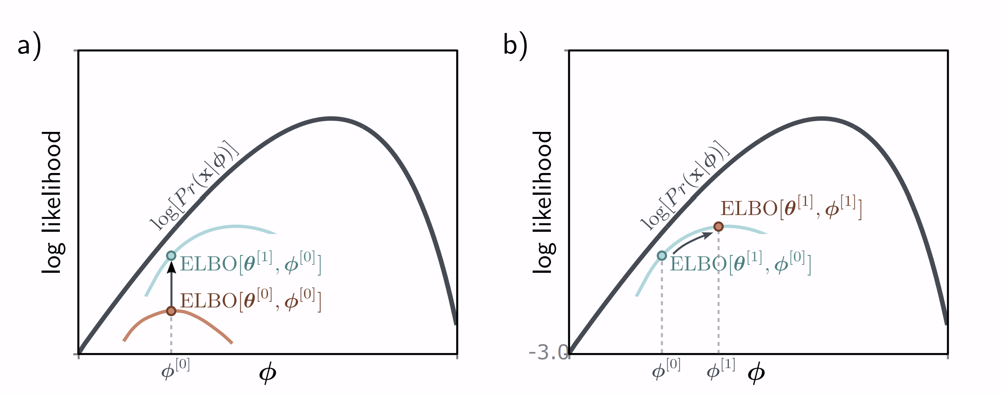

# Overview
- VAEs aim to model the probability distribution $p(\mathbf{x})$ over the random variable representing the data, which is $\mathbf{x}$.

- VAEs allow you to sample from $p(\mathbf{x})$, but cannot evaluate the probability density for given data samples.

- Maximum likelihood estimation is not possible - therefore, VAEs maximize a lower bound on the likelihood.

# Latent Variable Models
Model a joint distribution $p(\mathbf{x}, \mathbf{z})$, and express $p(\mathbf{x})$ as:
$$
\int p(\mathbf{x}, \mathbf{z}) d \mathbf{z}
$$
This joint distribution is typically modeled as this product:
$$
p(\mathbf{x}, \mathbf{z}) = p(\mathbf{x} | \mathbf{z}) p(\mathbf{z})
$$
This breakdown lets you model complex distributions. 

## Mixture of Gaussians
You can write a mixture of Gaussians this way, for instance the latent variable $\mathbf{z}$ could be discrete, and tell you which Gaussian you are sampling from, and $p(\mathbf{x} | \mathbf{z})$ would be a different Gaussian based on the value of $\mathbf{z}$.

We can compute $p(\mathbf{x})$ directly by marginalizing (summing) over $\mathbf{z}$.

## Continuous Latent Variable Model
$p(\mathbf{z})$ could be the standard normal distribution, and $p_{\phi}(\mathbf{x} | \mathbf{z})$ could be approximated by the decoder of a VAE, with mean $\mathbf{f}[\mathbf{z}, \phi]$ and spherical covariance $\sigma^2 \mathbf{I}$.

The data probability is
$$
p_{\phi}(\mathbf{x}) = \int p_{\phi}(\mathbf{x}, \mathbf{z}) d\mathbf{z}
$$
$$
 = \int p_{\phi}(\mathbf{x} | \mathbf{z}) p(\mathbf{z}) d\mathbf{z}
$$
$$
 = \int N_{\mathbf{x}}\left[ \mathbf{f}[\mathbf{z}, \phi], \sigma^2 \mathbf{I} \right] \cdot N_{\mathbf{z}} [\mathbf{0}, \mathbf{I}] d\mathbf{z}
$$

Which is a weighted sum of Gaussians of different means, where the means are the decoder outputs $\mathbf{f}[\mathbf{z}, \phi]$ where $\mathbf{z} \sim p(\mathbf{z})$, and the weight on each Gaussian is $p(\mathbf{z})$.

### Ancestral Sampling
You can generate samples by sampling $\mathbf{z} \sim N_{\mathbf{z}}[\mathbf{0}, \mathbf{I}]$ then passing it through the decoder, then sampling from the distribution outputted by the decoder.

# Derivation
The goal is to maximize the probability of the observed training data:
$$
\sum_{i=1}^N \log \left[ p_{\phi}(\mathbf{x}_i) \right]
$$
Our expression for $p_{\phi}(\mathbf{x})$ is 
$$
\int N_{\mathbf{x}}\left[ \mathbf{f}[\mathbf{z}, \phi], \sigma^2 \mathbf{I} \right] \cdot N_{\mathbf{z}} [\mathbf{0}, \mathbf{I}] d\mathbf{z}
$$
But computing this integral is intractable. Instead, we will maximize a lower bound on the log-likelihood, called the evidence lower bound or ELBO.

$$
\log \left[ p_{\phi}(\mathbf{x}) \right] = \log \left[\int p_{\phi}(\mathbf{x}, \mathbf{z}) d\mathbf{z} \right]
$$

Let $q_{\theta}(\mathbf{z} | \mathbf{x})$ be a distribution over $\mathbf{z}$.
$$
 = \log \left[\int q_{\theta}(\mathbf{z} | \mathbf{x})\frac{p_{\phi}(\mathbf{x},\mathbf{z})}{q_{\theta}(\mathbf{z} | \mathbf{x})} d\mathbf{z} \right]
$$
By Jensen's inequality, we get that this is greater than or equal to:
$$
 \geq \int q_{\theta}(\mathbf{z} | \mathbf{x}) \log \left[ \frac{p_{\phi}(\mathbf{x},\mathbf{z})}{q_{\theta}(\mathbf{z} | \mathbf{x})} \right] d\mathbf{z}
$$
This expression is called the evidence lower bound, since $p_{\phi}(\mathbf{x})$ is called the evidence in Bayes' rule.

## ELBO Intuition
The log-likelihood of the data is a function of the parameters $\phi$.

Similarly, the ELBO is also a function of the parameters $\phi$, for any fixed $\theta$. This function must lie below the log likelihood for all values of $\phi$.

When we change $\theta,$ we modify the ELBO function, which changes the lower bound.

When we change $\phi$, we are moving along the lower bound function.

## Tightness of Bound
$$
\text{ELBO}[\phi, \theta] =  \int q_{\theta}(\mathbf{z} | \mathbf{x}) \log \left[ \frac{p_{\phi}(\mathbf{x},\mathbf{z})}{q_{\theta}(\mathbf{z} | \mathbf{x})} \right] d\mathbf{z}
$$
Factoring out $p_{\phi}(\mathbf{x})$:
$$
= \int q_{\theta}(\mathbf{z} | \mathbf{x}) \log \left[ \frac{p_{\phi}(\mathbf{z} | \mathbf{x}) p_{\phi}(\mathbf{x})}{q_{\theta}(\mathbf{z} | \mathbf{x})} \right] d\mathbf{z}
$$
$$
= \int q_{\theta}(\mathbf{z} | \mathbf{x}) \left( \log\left[p_{\phi}(\mathbf{x}) \right] + \log \left[ \frac{p_{\phi}(\mathbf{z} | \mathbf{x}) }{q_{\theta}(\mathbf{z} | \mathbf{x})} \right] \right) d\mathbf{z}
$$
$$
= \int q_{\theta}(\mathbf{z} | \mathbf{x})  \log\left[p_{\phi}(\mathbf{x}) \right]d\mathbf{z} + \int q_{\theta}(\mathbf{z} | \mathbf{x}) \log \left[ \frac{p_{\phi}(\mathbf{z} | \mathbf{x}) }{q_{\theta}(\mathbf{z} | \mathbf{x})} \right] d\mathbf{z}
$$
$$
= \log\left[p_{\phi}(\mathbf{x}) \right] + \int q_{\theta}(\mathbf{z} | \mathbf{x}) \log \left[ \frac{p_{\phi}(\mathbf{z} | \mathbf{x}) }{q_{\theta}(\mathbf{z} | \mathbf{x})} \right] d\mathbf{z}
$$
$$
= \log\left[p_{\phi}(\mathbf{x}) \right] - \int q_{\theta}(\mathbf{z} | \mathbf{x}) \log \left[ \frac{q_{\theta}(\mathbf{z} | \mathbf{x})}{p_{\phi}(\mathbf{z} | \mathbf{x}) } \right] d\mathbf{z}
$$
$$
= \log\left[p_{\phi}(\mathbf{x}) \right] - \mathbb{E}_{\mathbf{z} \sim q_{\theta}(\mathbf{z} | \mathbf{x})} \left[ \log \left[ \frac{q_{\theta}(\mathbf{z} | \mathbf{x})}{p_{\phi}(\mathbf{z} | \mathbf{x}) } \right] \right]
$$
$$
= \log\left[p_{\phi}(\mathbf{x}) \right] - D_{\text{KL}}\left(q_{\theta}(\mathbf{z} | \mathbf{x}) \parallel p_{\phi}(\mathbf{z} | \mathbf{x}) \right)
$$
From this derivation, the ELBO is equal to the original log likelihood minus the KL divergence between $q_{\theta}(\mathbf{z} | \mathbf{x})$ and $p_{\phi}(\mathbf{z} | \mathbf{x})$. 

This KL is basically the difference between the encoder and decoder distributions.

The decoder (and prior) imply some distribution of $\mathbf{z}$ given $\mathbf{x}$, which is intractable to compute.

The encoder approximates that as best as it can with $q$.

## ELBO is Reconstruction Loss Minus Prior KL
$$
\text{ELBO}[\phi, \theta] =  \int q_{\theta}(\mathbf{z} | \mathbf{x}) \log \left[ \frac{p_{\phi}(\mathbf{x},\mathbf{z})}{q_{\theta}(\mathbf{z} | \mathbf{x})} \right] d\mathbf{z}
$$
Factoring out $p(\mathbf{z})$:
$$
= \int q_{\theta}(\mathbf{z} | \mathbf{x}) \log \left[ \frac{p_{\phi}(\mathbf{x} | \mathbf{z}) p(\mathbf{z})}{q_{\theta}(\mathbf{z} | \mathbf{x})} \right] d\mathbf{z}
$$
$$
= \int q_{\theta}(\mathbf{z} | \mathbf{x}) \log \left[ p_{\phi}(\mathbf{x} | \mathbf{z} ) \right] d \mathbf{z} + \int q_{\theta}(\mathbf{z} | \mathbf{x}) \log \left[ \frac{p(\mathbf{z})}{q_{\theta}(\mathbf{z} | \mathbf{x})} \right] d\mathbf{z}
$$
$$
= \mathbb{E}_{\mathbf{z} \sim q_{\theta}(\mathbf{z} | \mathbf{x})} \left[   \log \left[ p_{\phi}(\mathbf{x} | \mathbf{z} ) \right] \right]+ \mathbb{E}_{\mathbf{z} \sim q_{\theta}(\mathbf{z} | \mathbf{x})} \left[ \log \left[ \frac{p(\mathbf{z})}{q_{\theta}(\mathbf{z} | \mathbf{x})} \right] \right]
$$
$$
= \mathbb{E}_{\mathbf{z} \sim q_{\theta}(\mathbf{z} | \mathbf{x})} \left[   \log \left[ p_{\phi}(\mathbf{x} | \mathbf{z} ) \right] \right] - \mathbb{E}_{\mathbf{z} \sim q_{\theta}(\mathbf{z} | \mathbf{x})} \left[ \log \left[ \frac{q_{\theta}(\mathbf{z} | \mathbf{x})}{p(\mathbf{z})} \right] \right]
$$
$$
= \mathbb{E}_{\mathbf{z} \sim q_{\theta}(\mathbf{z} | \mathbf{x})} \left[   \log \left[ p_{\phi}(\mathbf{x} | \mathbf{z} ) \right] \right] - D_{\text{KL}}\left(q_{\theta}(\mathbf{z} | \mathbf{x}) \parallel p(\mathbf{z}) \right)
$$
In other words, you can view the ELBO (which we want to maximize) as a reconstruction term minus the divergence of $q_{\theta}(\mathbf{z} | \mathbf{x})$ from the prior $p(\mathbf{z})$.

# Questions
- What is the final model for $p(\mathbf{x})$?
- Figure 17.7 caption
- What does the KL divergence mean
