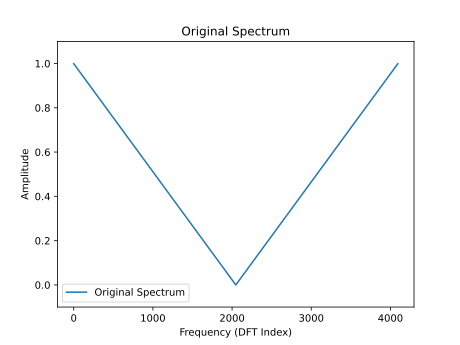
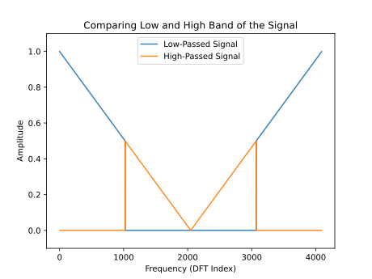
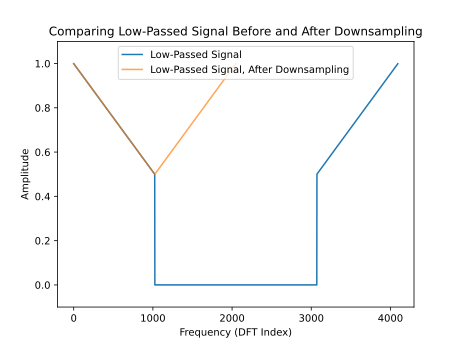
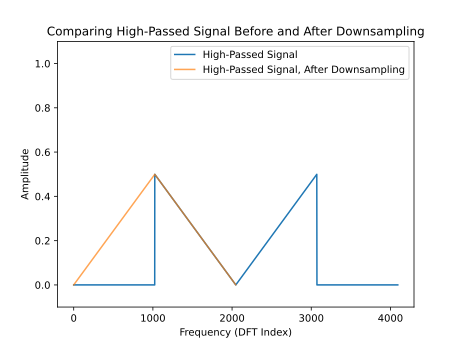
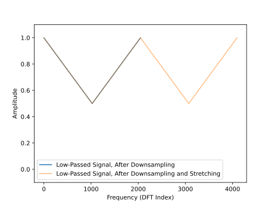
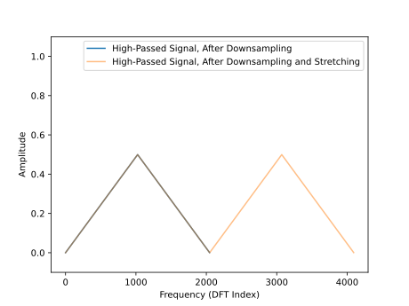

PQMF is a special way of decomposing a signal into different frequency bands. Suppose we have a signal, whose spectrum looks like this:

The filter bank works like this:

# Encoding
1. Filter signal into a low band and high band of frequencies

2. Downsample both by a factor of 2.
    1. For the low band, downsampling removes no information since no information exists in the top half of the spectrum.
    
    2. For the high band, downsampling also removes no information. In the downsampled signal, the high frequencies are mirrored, and occupy the low frequencies part of the spectrum.
    
3. Now we have split up our signal of length $N$ into two signals of length $N/2$. We can continue doing this as much as we like.

# Decoding
1. Upsample both using the stretch operator, which inserts a zero in every other sample:

2. Filter the high and low components, high-passing the high and low-passing the low. Then add them back together, and you will get your original signal.

# Notes
You can think of PQMF as a special case of audio CNNs. Low pass and high pass filters can be implemented through convolution. Downsampling often occurs in CNNs.Transpose convolution in the decoder is equivalent to stretching then applying a convolutional layer.

Last Reviewed: 10/4/2026