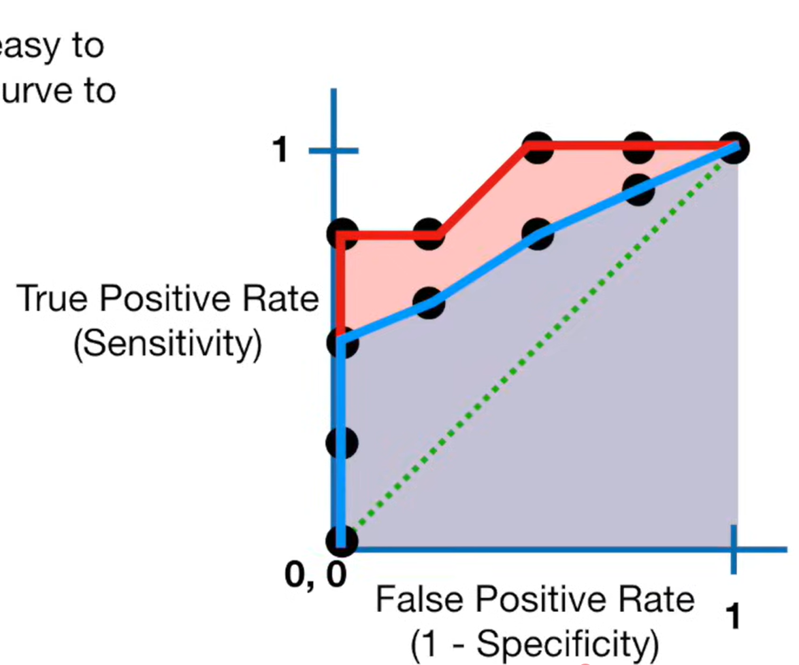

# Confusion Matrix:
- Rows = what machine learning algorithm predicted
- Columns = known truth

|                    | Actually Positive | Actually Negative |
| --------------------| -------------------| -------------------|
| Predicted Positive | TP                | FP                |
| Predicted Negative | FN                | TN                |

- False Negatives = "Not actually negative, algorithm says it is"
- False Positives = "Not actually positive, algorithm says it is"
- On-diagonal = Correct
- Off-diagonal = incorrect
- To compare two models on the same dataset, you can compare them across the two numbers on the diagonal (TP and TN counts)
    - Or, you can compare them on the two numbers off the diagonal (FP and FN rate)
    - These two numbers can disagree though.

# Precision and Recall
## Precision
- Labeled positive and is positive / Number of examples you labeled as positives
- True positives / (True positives + False positives)
- TP / (TP + FP)
- More useful than specificity/false positive rates when there are lots of negatives.

## Recall
- Labeled positive and is positive / Number of positives 
- TP / P
- TP / (TP + FN)
- "Accuracy on positive subset of test set examples"
- Also called true positive rate
- Also called "Sensitivity"

## Specificity
- What percentage of negatives were correctly identified as negative?
- Recall of the negative class
- TN / N
- TN / (TN + FP)
- "Accuracy on negative subset of test set examples"

## False Positive Rate
- FP/N
- 1 minus specificity
- 1 minus the accuracy on the negative subset of test set examples

## Analogy
Imagine you have some gold pellets in a bunch of dirt pellets. The gold pellets are the positive examples, and the dirt pellets are the negative examples.

You take a scoop out of the gold and dirt mixture.

Precision is the proportion of stuff in your scoop that is gold.

Recall/Sensitivity is how much of the total gold you got.

Specificity is the proportion of the dirt pellets you managed to ignore.

## Decisions
Choose the one with the better recall if capturing positives is more important
Choose the one with better specificity if capturing negatives is more important

## Generalization to multi-category
You can calculate precision, recall/sensitivity, and specificity for each category.

In this case consider positives to be in the category, and negatives to be not in category.

# F1 Score
- Harmonic mean of precision and recall.
- Harmonic so that a terrible value kills the score
- Arithmetic means that 50% is always guaranteed.

# Threshold
- Your model gives you a score, you can threshold this score to determine if something gets classified as positive or negative.
- Each threshold gives you a (precision, recall) pair.

- You can look at your test data and figure out how low you need to set your threshold to get 100% recall
- You can also look at your test data and figure out how high you need to set your threshold to get 100% precision, which is also 100% specificity
    - might not be possible if the highest-scoring example is a negative example.
- To decide which threshold is best, you only need to consider the thresholds where test datapoints lie.

# ROC Graph
- Y axis - True positive rate
- X axis - False positive rate
- Threshold 0 gives y=1, x=1
- Threshold 1 gives us x=0 (no false positives), y=0
- Thresholding such that only positive examples are above the threshold gives us x=0, y=(something)
- y = x  is where true positive rate equals false positive rate
- above the line means that the true positive rate is higher than the false positive rate.
- You can consider some thresholds to be strictly better than others based on the ROC graph. 
- Up and to the left is good
- The Pareto frontier is up and to the left.

# AUC
- Area under the ROC curve, in [0, 1] x [0, 1]
- More area is better.

# Averaging
- Micro-averaging - average per example
- Macro-averaging - average per language