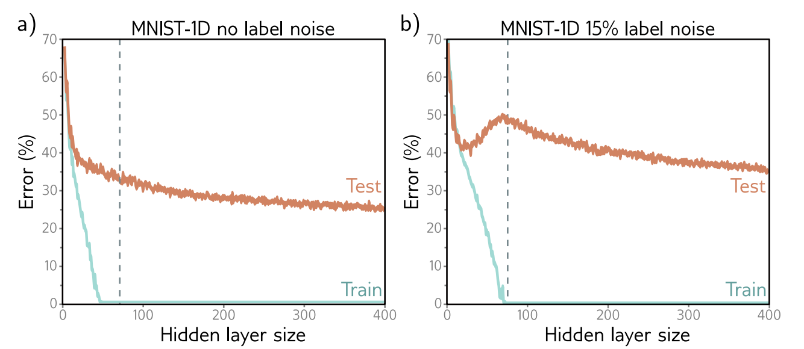
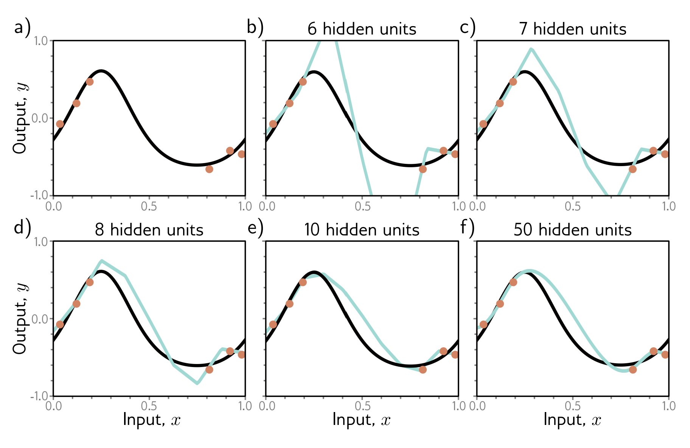

# Definition

**Double Descent** is the phenonmenon where, as we increase the number of parameters in a neural network, test loss will decrease at first (classical/underparametrized regime), then increase as we overfit to the training set and the number of parameters reaches the number of training points (critical regime), then decrease once more as we add more parameters (modern regime).

# MNIST 1D Example

When fitting to 1D MNIST, as we increase the number of parameters, these things happen:
1. The train error goes to zero
2. Then, the number of parameters equals the number of datapoints (at the dashed line)
3. The test error continues to decrease as we increase the number of parameters.

When fitting to 1D MNIST with noisy labels, as we increase the number of parameters, these things happens:
1. The train error goes to zero
2. Only a little while later, the number of parameters equals the number of datapoints. In this case, more parameters are needed to fit the noisy labels.
3. Before the training data is perfectly fixed, the test error decreases, then increases
4. Then as the number of parameters increases further (beyond the number of datapoints), test error decreases again, imrproving beyond the local minimum in the classical regime.

# Datasets
In MNIST, double descent is present with the original data. For CIFAR-100 and MNIST-1D, it emerges when we add noise to the data labels.

# Explanation
1. The test performance becomes worse when the number of parameters approaches the number of datapoints, as predicted by the bias-variance tradeoff
    1. As the number of parameters approaches the number of examples, the model can contort itself to fit all the datapoints, but this function will not be very smooth, and may not generalize well.
2. The test performance becomes better beyond this point.
    1. Here, the model fits the training data almost perfectly
    2. Thus, improvements come from between the datapoints (**inductive bias**). 
    3. Datapoints are very sparse in high-dimensional space (**curse of dimensionality**)
    4. More parameters result in smoother functions that interpolate the training data. Why this happens is unknown, since more parameters can also model very non-smooth functions, but here are two possibilities:
        1. Network initialization is a smooth function, and the training process does not depart much from the initial values, keeping the model in the smooth subdomain.
        2. Training algorithm may prefer smooth functions (it acts as an implicit regularizer)
   5. This results in better generalization.

Below, we have sparse datapoints and plot the smoothest possible fit for a 2-layer MLP given each number of hidden units. You see that the more hidden units we add, the smoother the curve is.

# More terms
- **Inductive Bias** - model's tendency to prioritize one solution over another between data points
- **Regularizer** - factor that biases a model's solution toward a subset of equivalent solutions.
- **Curse of Dimensionality** - The volume of high-dimensional space typically overwhelms the number of datapoints. If you have high-dimensional input data, it is nearly impossible to cover the input space. For instance, if your input data is 40-dimensional, you can quantize each dimension into 10 bins and get $10^{40}$ bins! Even with 10k examples, there will only be one data point in every $10^{36}$ datapoints.
- 

Last Reviewed: 8/12/2026